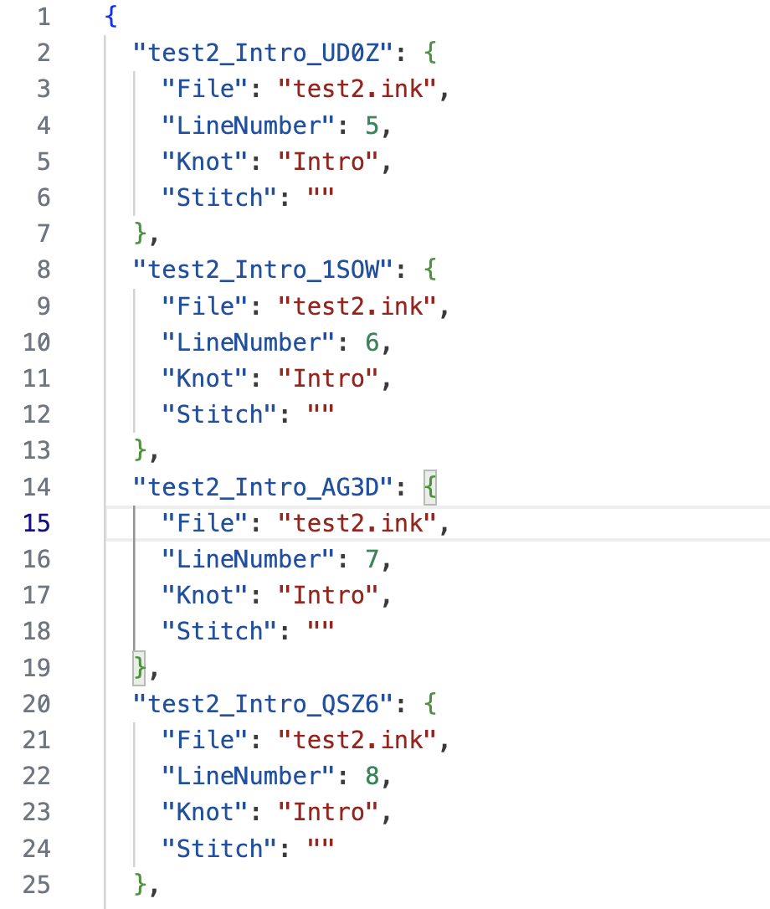

# Ink-Localiser

**A simple tool to make it easier to localise or attach voice lines to Ink projects.**


## Contents

- [Overview](#overview)
- [Command-Line Tool](#command-line-tool)
- [Limitations](#limitations)
- [Use in Development](#use-in-development)
- [The ID format](#the-id-format)
- [Releases](#releases)
- [Caveats](#caveats)
- [Under the Hood](#under-the-hood)
- [Acknowledgements](#acknowledgements)
- [License and Attribution](#license-and-attribution)

## Overview

Inkle's Ink language is a great flow language for stitching together narrative-based games.

Because it's designed to mash small fragments of text together, it's not designed for localisation, or for associating lines of spoken audio to the source file.

But many studios don't use the more advanced text-manipulation features of Ink - they just use it for creating a flow of complete lines of text. It's a great solution for titles that care about branching dialogue. This means there's a problem - how do you translate each line? And how do you play the right audio for each line?

This tool takes a set of raw ink files, scans them for lines of text, and generates a localisation ID to associate with each line. It writes the ink files back out again with these IDs in the form of Ink tags at the end of each line.

This means that every line of meaningful text in the Ink file now has a unique ID attached, as a tag. That means you can use that ID for localisation or for triggering the correct audio.

The tool also optionally exports CSV or JSON files containing the IDs and their associated text content from all the processed Ink files - which can then be used as a basis for localisation.

Each time the tool is run, it preserves the old IDs, just adding them to any newly appeared lines.

So for example, take this source file:


After the tool is run, the source file is rewritten like this:


It also creates an optional CSV fioe of strings like so:


And an optional JSON file of strings like so:


And an optional JSON file breaking down where each line comes from, like so:

(This last one is handy for toolchains or debugging.)

## Command-Line Tool

This is a command-line utility with a few arguments. A few simple examples:

Look for every Ink file in the `inkFiles` folder, process them for IDs, and output the data in the file `output/strings.json`:

`LocaliserTool.exe --folder=inkFiles/ --json=output/strings.json`

Look for every Ink file starting with `start` in the `inkFiles` folder, process them for IDs, and output the data in the file `output/strings.csv`:

`LocaliserTool.exe --folder=inkFiles/ --filePattern=start*.ink --csv=output/strings.csv`

### Arguments

- `--folder=<folder>`

    Root folder to scan for Ink files to localise relative to working dir. 
    e.g. `--folder=inkFiles/` 
    Default is the current working dir.

- `--filePattern=<folder>`

    Root folder to scan for Ink files to localise.
    e.g. `--filePattern=start-*.ink`
    Default is `*.ink`

- `--csv=<csvFile>`

    Path to a CSV file to export all the strings to, relative to working dir.
    e.g. `--csv=output/strings.csv`
    Default is empty, so no CSV file will be exported.

- `--json=<jsonFile>`

    Path to a JSON file to export all the strings to, relative to working dir.
    e.g. `--json=output/strings.json`
    Default is empty, so no JSON file will be exported.

- `--retag`

    Regenerate all localisation tag IDs, rather than keep old IDs.

- `--origins=<originsFile>`

    Output a file which lists which file and line each ID comes from.

- `--shortIDs`

    Use short-form IDs which are just the hashcode instead of including the file/knot/stitch,
    if you don't care where they come from.

- `--help`

    This help!

## Limitations

As said above, Ink is fully capable of stitching together fragments of sentences, like so:

```text
{shuffle:
- Here is a sentence <>
- Here is a different sentence <>
}
that will end up saying the same thing.

* I talked about sailing ships [] and the preponderance of seamonsters.
    -> MarineLife
* I didn't like monkeys [at all.] in any way whatsoever.
    -> MonkeyBusiness
```

This splicing of text fragments **is not supported by the Localiser**, as the Localiser is designed for two main use cases.

- **Producing strings for localisation**. It is really hard as a translator to work stitching text fragments together, as English works very differently from other languages. So if you want your game localised, text fragments are, in general, not a good idea.

- **Producing strings for audio recording**. It is almost impossible to splice together different sections of sentences for an actor to say, so again, we shouldn't be using text fragments.

Ink is still extremely powerful and we use it for lots of other flow use-cases. But for these reasons if you have multiple text fragments on a single line the Localiser will complain with an error.

(It should also complain for <> as well but I haven't got around to adding that behaviour.)

## Use in Development

Develop your Ink as normal! Treat that as the 'master copy' of your game, the source of truth for the flow and your primary language content.

Use LocaliserTool to add IDs to your Ink file and to extract a file of the content. Get that file localised/translated as you need for your title. Remember that you can re-run LocaliserTool every time you alter your Ink files and everything will be updated.

At runtime, load your Ink content, and also load the appropriate JSON or CSV (which should depend on your localisation).

Use your Ink flow as normal, but when you progress the story instead of asking Ink for the text content at the current line or option, ask for the list of tags!

Look for any tag starting with #id:, parse the ID from that tag yourself, and ask your CSV or JSON file for the actual string. You can use the same ID to trigger an appropriate voice line, if you've recorded one.

In other words - during runtime, just use Ink for logic, not for content. Grab the tags from Ink, and use your external text file (or WAV filenames!) as appropriate for the relevant language.

**Pseudocode**:

```text
var story = new Story(storyJsonAsset);
var stringTable = new StringTable(tableCSVAsset);

while (story.canContinue) {

    var textContent = story.Continue();
    
    // we Can actually IGNORE the textContent, we want the LOCALISED version, let's find it:

    // This function looks for a tag like #id:Main_Intro_45EW
    var stringID = extractIDFromTags(story.currentTags);

    var localisedTextContent = stringTable.GetStringByID(stringID);

    // We use that localisedTextContent instead!
    DisplayTextSomehow(localisedTextContent);

    // We could also trigger some dialogue...
    PlayAnAudioFileWithID(stringID);

    // Now let's do choices
    if(story.currentChoices.Count > 0)
    {
        for (int i = 0; i < story.currentChoices.Count; ++i) {
            Choice choice = story.currentChoices [i];

            var choiceText = choice.text;
            // Again, we can IGNORE choiceText...

            var choiceStringID = extractIDFromTags(choice.tags);

            var localisedChoiceTextContent = stringTable.GetStringByID(choiceStringID);

            // We use that localisedChoiceTextContent instead!
            DisplayChoiceTextSomehow(localisedChoiceTextContent);

        }
    }
}
```

## The ID format

The IDs are constructed like this:

`<filename>_<knot>(_<stitch>)_<code>`

- `filename`: The root name of the Ink file this string is in.
- `knot`: The name of the containing knot this string is in.
- `stitch`: If this is inside a stitch, the name of that stitch
- `code`: A four-character random code which will be unique to this knot or knot/stitch combination.

This is mainly to make it easy during development to figure out where a line originated in the Ink files - it's fairly arbitrary, so IDs can be moved around safely without changing (even if the lookup will then be unhelpful). You can always delete an ID and let it regenerate if you want something more appropriate to the place where you've moved a line.

### Short IDs

If you turn on `--shortIDs` the IDs will just be the four-character code, instead. YMMV. I prefer the full-length IDs so I can have a fair idea where a line is from when I see an ID.

## Releases

You can find releases for various platforms [here](https://github.com/wildwinter/Ink-Localiser/releases
).

There's also a Lib version if you want to be able to access it via the DLL as part of your toolchain. The DLL depends on Inkle's `ink_compiler.dll` and `ink-engine-runtime.dll`.

## Caveats

This isn't very complicated or sophisticated, so your mileage may vary!

**WARNING**: This rewrites your `.ink` files! And it might break, you never know! It's always good practice to use version control in case a process eats your content, and this is another reason why!

**Inky might not notice**: If for some reason you run this tool while Inky is open, Inky will probably not reload the rebuilt `.ink` file. Use Ctrl-R or CMD-R to reload the file Inky is working on.

## Under the Hood

Developed in .NET / C#.

The tool internally uses Inkle's **Ink Parser** to chunk up the ink file into useful tokens, then sifts through that for textual content. Be warned that this isn't tested in huge numbers of situations - if you spot any weirdness, let me sknow!

## Acknowledgements

Obviously, huge thanks to [Inkle](https://www.inklestudios.com/) (and **Joseph Humfrey** in particular) for [Ink](https://www.inklestudios.com/ink/) and the ecosystem around it, it's made my life way easier.

## License and Attribution

This is licensed under the MIT license - you should find it in the root folder. If you're successfully or unsuccessfully using this tool, I'd love to hear about it!

You can find me [on Medium, here](https://wildwinter.medium.com/).
