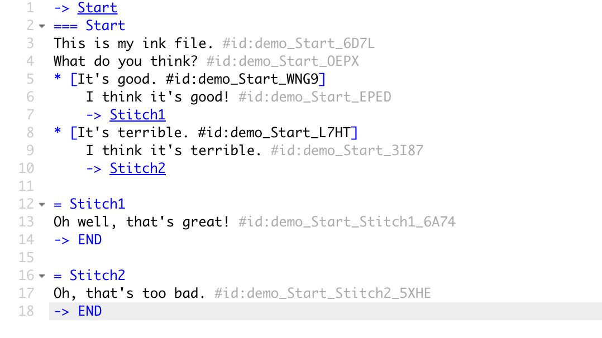
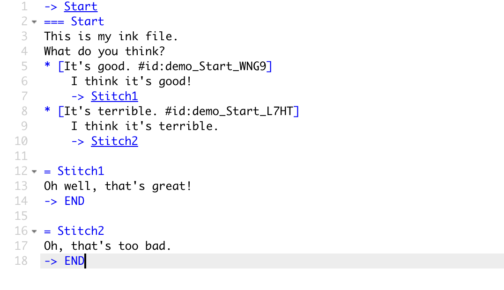
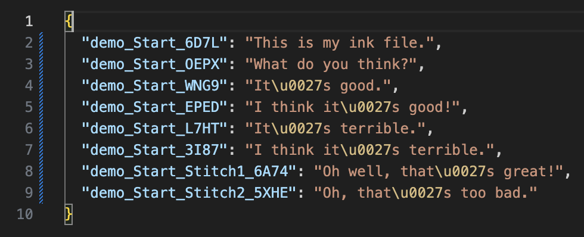

# Ink-Localiser

**A simple tool to make it easier to localise Ink projects.**

## Overview

Inkle's Ink language is a great flow language for stitching together narrative-based games.

Because it's designed to mash small fragments of text together, it's not designed for localisation, or for associating lines of spoken audio to the source file.

But many studios don't use the more advanced text-manipulation features of Ink - they just use it for creating a flow of complete lines of text. It's a great solution for titles that care about branching dialogue. This means there's a problem - how do you translate each line? And how to you play the right audio for each line?

This tool takes a set of raw ink files, scans them for lines of text, and generates a localisation ID to associate with each line. It writes the ink files back out again with these IDs in the form of Ink tags at the end of each line.

This means that every line of meaninful text in the Ink file now has a unique ID attached, as a tag. That means you can use that ID for localisation or for triggering the correct audio.

The tool also optionally exports CSV or JSON files containing all the IDs and their associated text - which can then be used as a basis for localisation.

Each time the tool is run, it preserves the old IDs, just adding them to any newly appeared lines.

So for example, take this source file:

After the tool is run, the source file is rewritten like this:

It also creates an optional CSV file like so:

And an optional JSON file like so:

## Usage
This is a command-line utility with a few arguments. A few simple examples:

Look for every Ink file in the `inkFiles` folder, process them for IDs, and output the data in the file `output/strings.json`:

`Localiser.exe --folder=inkFiles/ --json=output/strings.json`

Look for every Ink file starting with `start` in the `inkFiles` folder, process them for IDs, and output the data in the file `output/strings.csv`:

`Localiser.exe --folder=inkFiles/ --filePattern=start*.ink --csv=output/strings.csv`

### Arguments
* `--folder=<folder>`
    
    Root folder to scan for Ink files to localise relative to working dir. 
    e.g. `--folder=inkFiles/` 
    Default is the current working dir.

* `--filePattern=<folder>`

    Root folder to scan for Ink files to localise.
    e.g. `--filePattern=start-*.ink`
    Default is `*.ink`

* `--csv=<csvFile>`

    Path to a CSV file to export, relative to working dir.
    e.g. `--csv=output/strings.csv`
    Default is empty, so no CSV file will be exported.

* `--json=<jsonFile>`

    Path to a JSON file to export, relative to working dir.
    e.g. `--json=output/strings.json`
    Default is empty, so no JSON file will be exported.

* `--retag`

    Regenerate all localisation tag IDs, rather than keep old IDs.

* `--help`

    This help!

### Usage in Engine
The normal pattern of usage for this is to load your Ink file, load the appropriate JSON or CSV or whatever (which hopefully will depend on your localisation). 

Then use your Ink flow as normal, but instead of asking Ink for the text content of a line or an option, ask for the list of tags! Look for any tag starting with #id:, parse the ID from that tag yourself, and ask your CSV or JSON file for the actual string.

In other words - during runtime, just use Ink for logic, not for content. Grab the tags from Ink, and use your external text file (or WAV filenames!) as appropriate for the relevant language.

## Caveats
This isn't very complicated or sophisticated, so your mileage may vary!

**WARNING**: This rewrites your `.ink` files! And it might break, you never know! It's always good practice to use version control in case a process eats your content, and this is another reason why!

**Inky might not notice**: If for some reason you run this tool while Inky is open, Inky will probably not reload the rebuilt `.ink` file. Use Ctrl-R or CMD-R to reload the file Inky is working on.

## Under the Hood
This internally uses Inkle's **Ink Parser** to chunk up the ink file into useful tokens, then sifts through that for textual content. Be warned that this isn't tested in huge numbers of situations - if you spot any weirdness, let me sknow!

## Acknowledgements
Obviously, huge thanks to [Inkle](https://www.inklestudios.com/) (and **Joseph Humfrey** in particular) for [Ink](https://www.inklestudios.com/ink/) and the ecosystem around it, it's made my life way easier.

## License and Attribution
This is licensed under the MIT license - you should find it in the root folder. If you're successfully or unsuccessfully using this tool, I'd love to hear about it!

You can find me [on Medium, here](https://wildwinter.medium.com/).